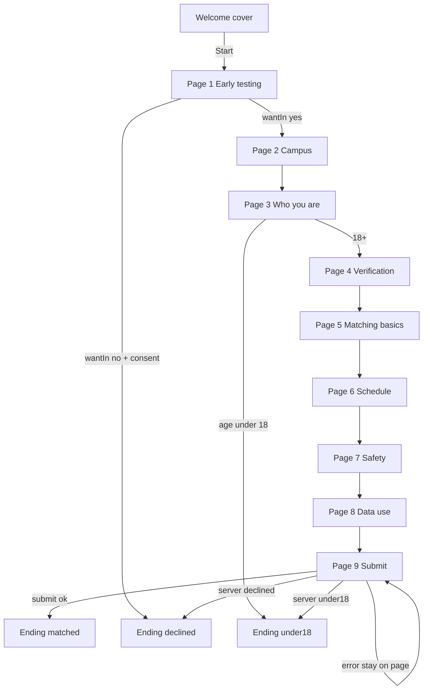

# Test Run redesign brief (design only)

**For the next agent.** Read this file before changing anything under `/TestRun`.

**Branch:** `new-ac-form`  
**Surface:** `/TestRun` (aliases `/testrun`, `/test-run` → `/TestRun` via middleware)  
**Primary files:**

- [`components/test-run/test-run-form.tsx`](../../components/test-run/test-run-form.tsx) — wizard UI
- [`components/test-run/fields.tsx`](../../components/test-run/fields.tsx) — field widgets
- [`components/test-run/test-run-mark.tsx`](../../components/test-run/test-run-mark.tsx) — butterfly mark
- [`app/TestRun/page.tsx`](../../app/TestRun/page.tsx) — route entry
- [`app/TestRun/layout.tsx`](../../app/TestRun/layout.tsx) — layout / theme class
- [`lib/test-run-content.ts`](../../lib/test-run-content.ts) — copy + option enums (keep field meaning)
- [`lib/validations/test-run.ts`](../../lib/validations/test-run.ts) — Zod / page validation (do not break)
- [`app/actions/test-run.ts`](../../app/actions/test-run.ts) — submit contract (do not break)
- [`app/globals.css`](../../app/globals.css) — `.test-run` theme overrides

This is **not** the marketing site (`app/(marketing)`), not Partners/Contact, and not the waitlist on `join.afterclassapp.com`.

---

## Hard rule

**Change the design extensively. Do not change the flow.**

Allowed:

- Layout, spacing, color, typography, motion, chrome, progress UI, cover/ending presentation
- Replacing or removing the logo/mark. If a brand mark slot is still needed for layout balance, use a **random placeholder** (simple shape, initials block, or temp SVG) so a real logo can drop in later
- New fonts and font styles (weights, sizes, tracking, hierarchy)
- Visual system different from the current coral/cream Typeform look, as long as the product still works

Not allowed unless the human explicitly expands scope:

- Adding, removing, or reordering screens in the graph below
- Changing branch rules (declined / under-18 endings)
- Changing required vs optional fields, validation rules, or enum options
- Changing `submitTestRun` payload shape, storage, or Supabase writes
- Linking this surface into marketing nav or waitlist convert
- Rewriting product meaning of copy (tone polish is fine; do not invent new steps)

If design needs copy length tweaks, keep the same keys in `lib/test-run-content.ts` and the same validation contracts.

---

## Flow to retain (exact)

Screen model in code: `welcome` | `1`…`9` | `ending-ok` | `ending-no` | `ending-age`

### Navigation behavior (keep)

- **Continue** validates the current page only (except submit re-validates all)
- **Back** goes to previous page; from page 1 back → welcome
- **Enter** advances when the current control allows it
- Progress is **N / 9** on form pages
- Query prefill: `?email=` and `?heard=` / `howHeard` / `source`
- On leaving page 4, if `school` is empty, copy `campus` into `school`
- Under-18 and declined paths must **not** store a signup

### Page field inventory (keep)

| Screen | Title | Fields / content |
|--------|--------|------------------|
| Welcome | Cover | Brand/tagline presentation, Start CTA |
| 1 | Early testing | Statement, consent (required), wantIn yes/no. No → ending-no if consent |
| 2 | Campus | campus, cityCorridor (+ cityCorridorOther if Other) |
| 3 | Who you are | fullName, age (18+ gate), email (personal inbox warn ok), phone, socials optional, contactPreference |
| 4 | Verification | facePhoto, schoolIdPhoto, isMe |
| 5 | Matching basics | gender (+ genderOther), meetGenders multi, school, yearLevel, departureArea, maxTravel, nearbySchoolOk, dealbreakers, aboutYou, preferredCafes/refuseAreas optional, coverOwnOrder, accessibility optional |
| 6 | Schedule | schedule, hardNos optional |
| 7 | Safety | understandEarly, publicCafe, cancelEarly, canReport required; interviewOk; emergencyName/Phone recommended |
| 8 | Data use | Read-only policy lines + understand required |
| 9 | Submit | everythingTrue required, howHeard optional → `submitTestRun` |

### Endings (keep meaning)

| Ending | When | Meaning |
|--------|------|---------|
| `ending-ok` | Successful submit | On the list; founders will message |
| `ending-no` | Declined want-in | No signup stored |
| `ending-age` | Age &lt; 18 | 18+ only; no signup stored |

Option enums stay sourced from `testRunContent` (city, gender, meet, year, travel, contact) so Zod stays in sync.

### Submit contract (keep)

- Client builds `FormData` and calls `submitTestRun`
- Server: Zod → optional rate limit → upload face + school ID to `test-run-private` → insert `test_run_signups`
- Photos: jpeg/png/webp/heic/heif, ≤5 MB each
- `robots: noindex`, `force-dynamic`, `maxDuration = 60` stay

---

## Design freedom (extensive)

Current look (baseline to replace, not sacred):

- Coral/salmon full-bleed cover and endings
- Cream clipboard form body, charcoal type, maroon titles, salmon progress
- Open Sauce Two only on this surface
- Inline SVG butterfly (`TestRunMark`)

You may throw that visual system out. Prefer a coherent new system over small tweaks.

### Logo / mark

- You may **remove** the butterfly entirely
- Or **replace** it with a placeholder mark (neutral block, initials “AC”, geometric stub)
- Mark placeholder clearly in code comments as temporary for final brand art later
- Do not depend on marketing `LogoMark` / `/logo-mark.png` unless that is an intentional shared asset choice

### Typography

- New font family/families allowed (self-host or already-available stack; avoid breaking Next font loading)
- New scale, weights, and styles for cover, questions, helpers, errors, CTAs, endings
- Keep text readable and form usability intact (labels, errors, focus)

### Scope notes

- Prefer confining CSS to Test Run layout / `.test-run` / component classes so marketing maroon home stays untouched
- Do not “fix” waitlist, Partners, or Contact as part of this brief
- Prove the redesign by walking welcome → page 9 → success ending in the browser (or document blockers)

---

## Done when

1. Flow graph and field inventory above still match runtime behavior
2. Visual redesign is clearly new (fonts + mark treatment + overall UI), not a light restyle
3. Marketing routes look unchanged
4. Submit still reaches `submitTestRun` with the same fields

## Out of scope

- Product strategy, new steps, new audiences
- Supabase schema changes
- Waitlist / marketing redesign
- Committing or pushing unless the human asks
